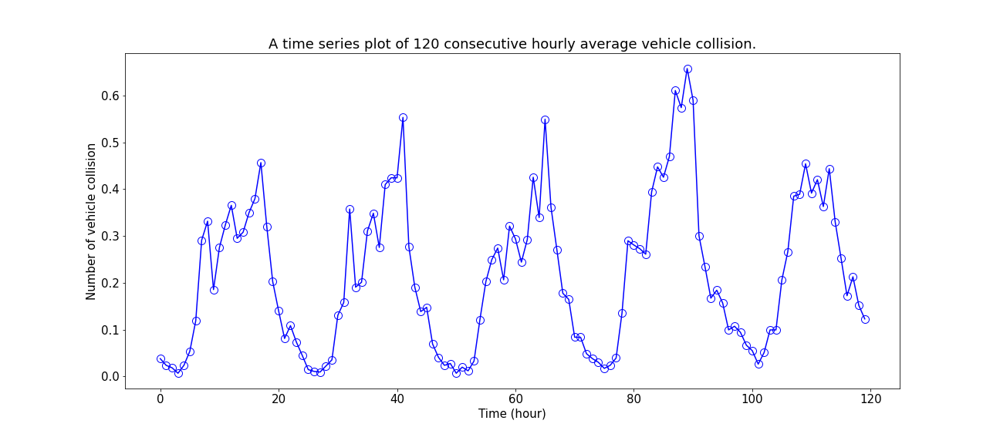
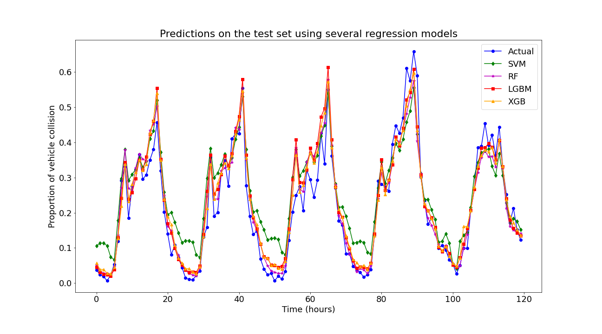
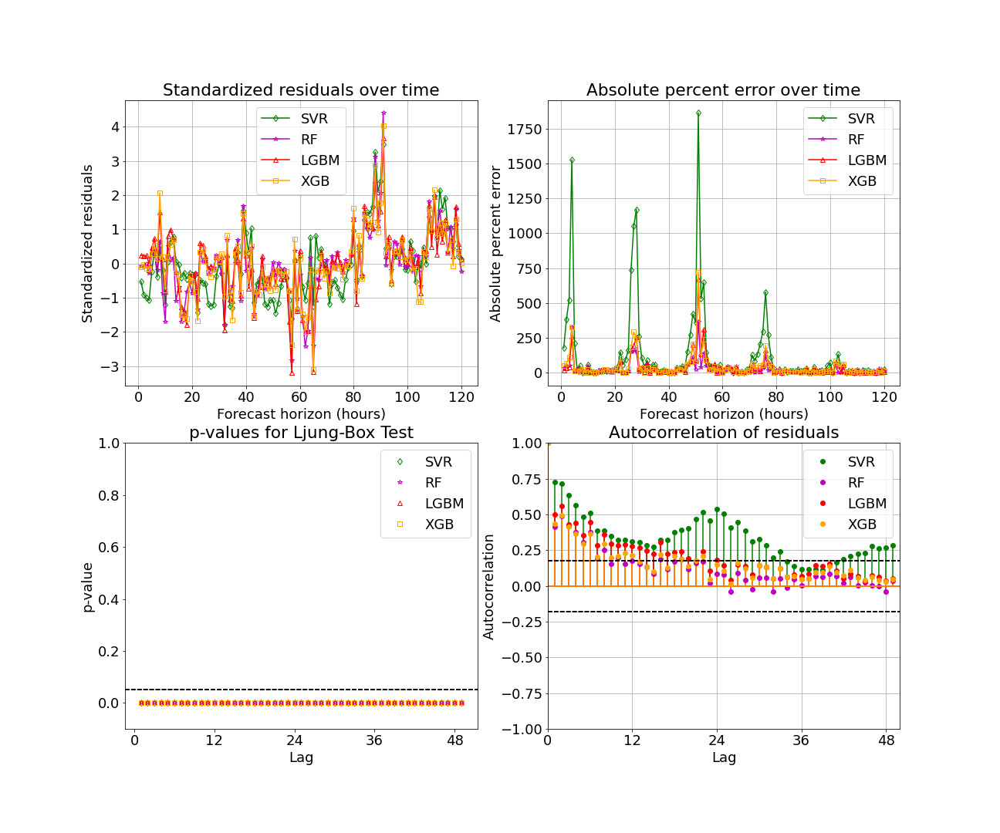
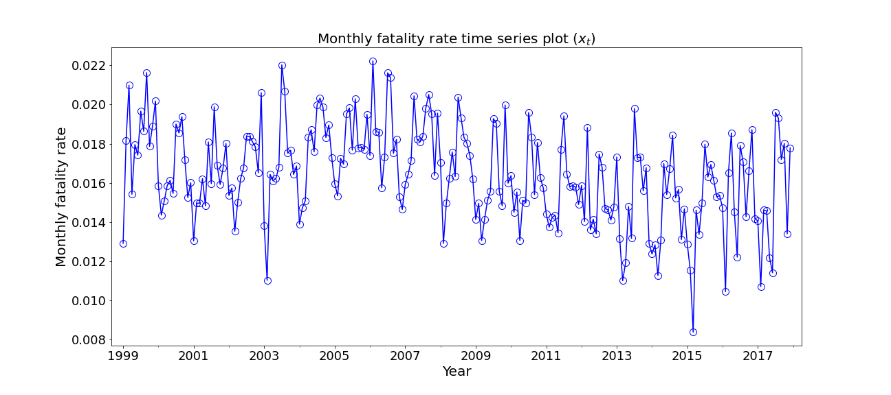
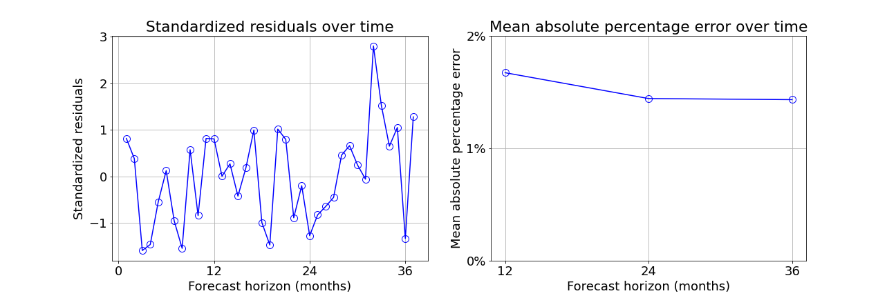
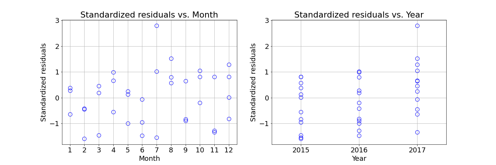
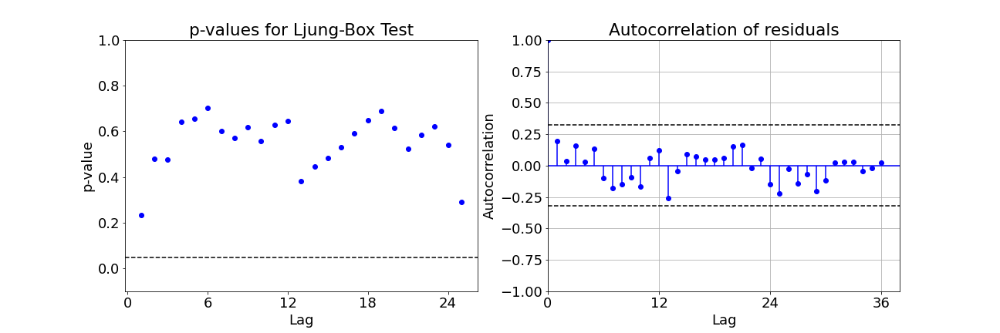

# Time Series Forecasting 

## 2. Hourly Fatality Forecasting (ML Models)

### 2A. Data Information: [open.canada.ca](https://open.canada.ca/data/en/dataset/1eb9eba7-71d1-4b30-9fb1-30cbdab7e63a)

### 2B. Time Series Plot

### 2C. Forecasting on the Test Set

### 2D. Model Diagnostics Plots on the Test Set

## 2. Monthly Fatality Forecasting (FB Prophet)

### 2A. Data Information: [open.canada.ca](https://open.canada.ca/data/en/dataset/1eb9eba7-71d1-4b30-9fb1-30cbdab7e63a)

### 2B. Time Series Plot

### 2C. Forecasting on the Test Set

### 2D. Model Diagnostics Plots on the Test Set

### 2E. Ljung-Box Test

## 3. Sales Forecasting (ARIMA)

### 3A. Time Series Plot

### 3B. Forecasting on the Test Set

### 3C. Model Diagnostics Plots on the Test Set

### 3D. Ljung-Box Test

### 3E. Future Forecasts
