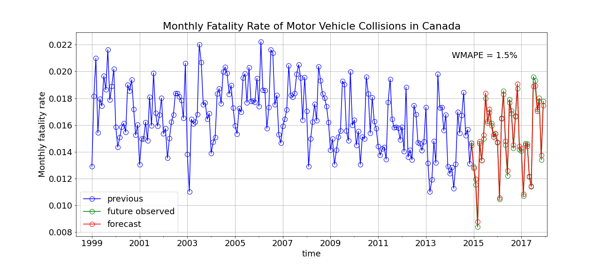
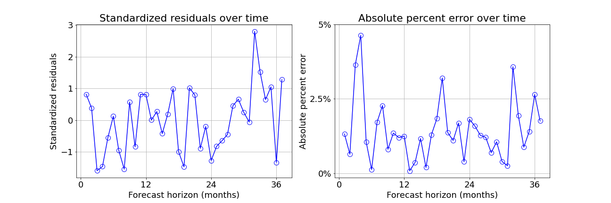
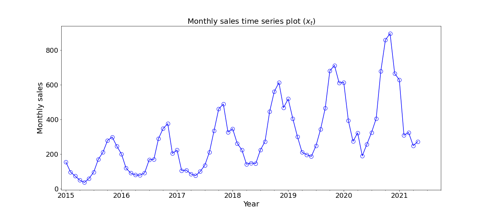
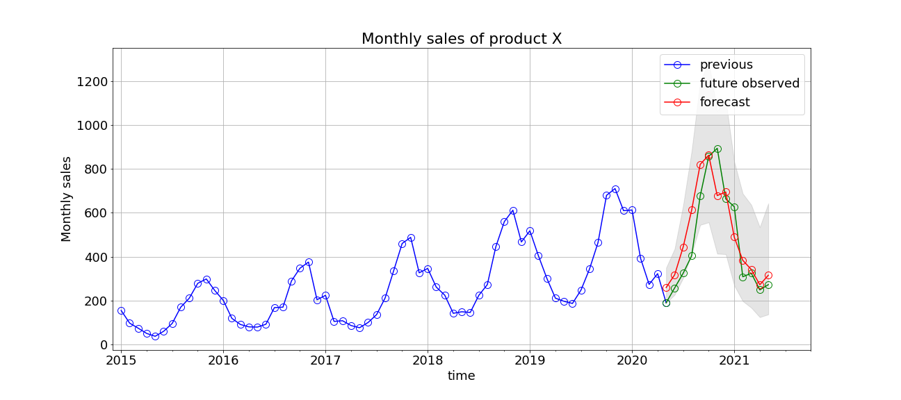
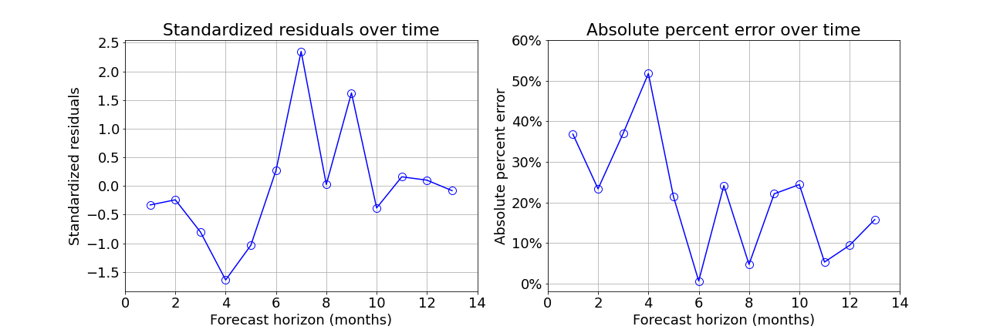
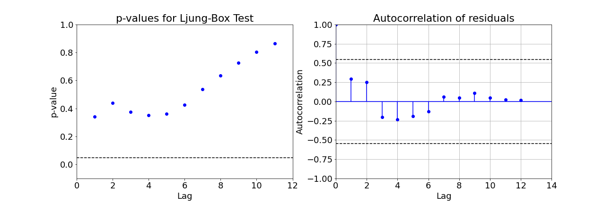
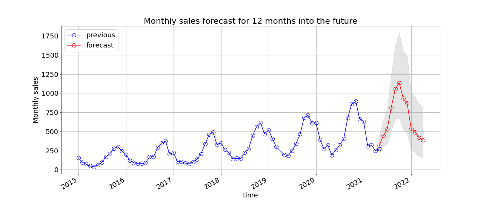

# Time Series Forecasting 

## 1. Fatality Forecasting (FB Prophet)

## 1A. Data Information: [open.canada.ca](https://open.canada.ca/data/en/dataset/1eb9eba7-71d1-4b30-9fb1-30cbdab7e63a)

## 1B. Time Series Plot

## 1C. Forecasting on the Test Set

## 1D. Model Diagnostics Plots on the Test Set

## 1E. Ljung-Box Test

## 2. Sales Forecasting (ARIMA)

## 2A. Time Series Plot

## 2B. Forecasting on the Test Set

## 2C. Model Diagnostics Plots on the Test Set

## 2D. Ljung-Box Test

## 2E. Future Forecasts
